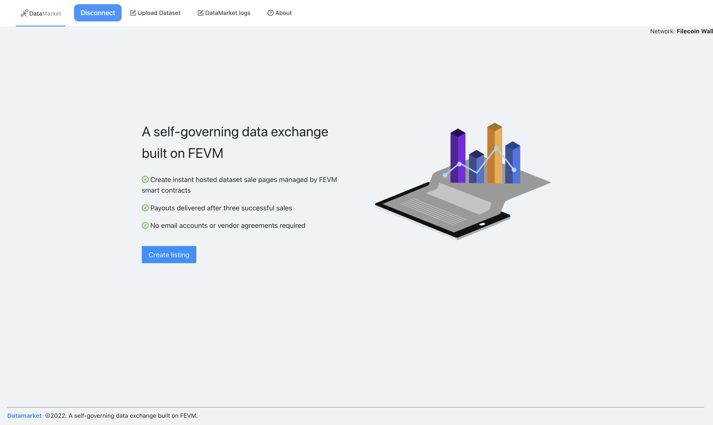
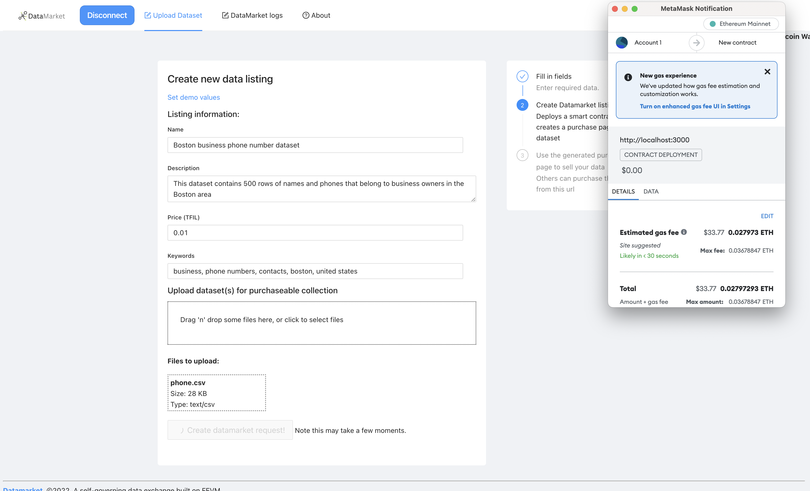
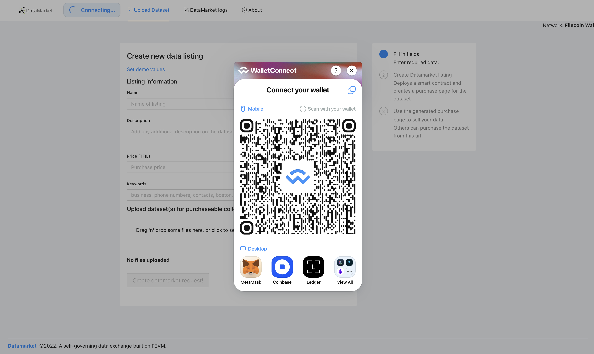
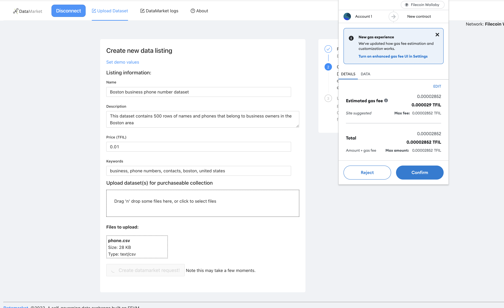
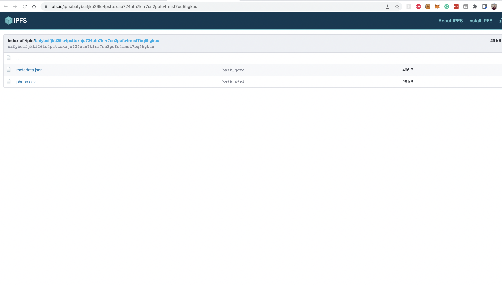
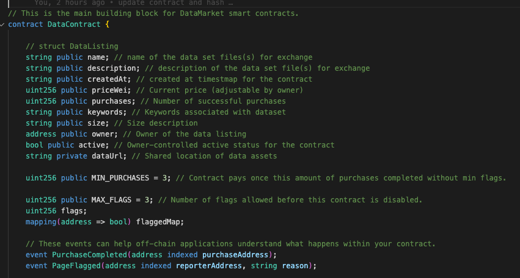
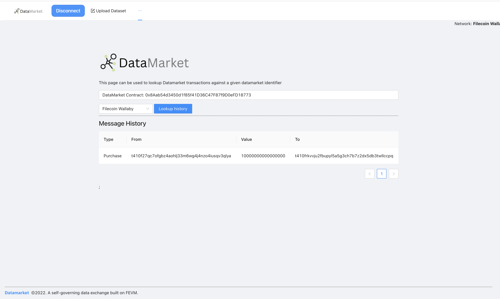

 

    

 

Datamarket
---

Datamarket is an open blockchain platform designed for creating Data sale pages on the FEVM network. 

This project was built for HackFEVM 2022 on ethglobal, submitted to the Best use of FEVM to build building blocks and general category.

<b>Note this project is currently a demo prototype and would require additional work to be production ready on FEVM mainnet.</b>

<!--

### Motivation

Decentralized exchanges, also known as DEXs, are peer-to-peer marketplaces where cryptocurrency traders make transactions directly without handing over management of their funds to an intermediary or custodian.

For those vendors using existing software platforms (such as Flexport), much of the data is only held centrally within those platforms, subject to custom terms and conditions, and modifiable by their internal teams. Also often need to have a formal app B2B subscription plan.

Other common challenges that occur outside of platforms can include limitations from the non-universal nature of email (emails are private between sender and recipient), delays might not be accurately or consistently reported, and products might be lost.

### How it works

Users create data pages which are purchase pages for secured IPFS datasets.

DataMarket is self-governing. If a bad or inaccurate dataset is uploaded and sold, a purchaser or potential purchaser can flag the dataset as being fraudulent. The dataset page is locked after three flags.

To ensure that the data provides user satisfaction, the user is only paid out from the contract after three non-flagged successful sales, and each sale after that. This is done automatically via logic tied to the `purchaseData` contract method 

Each dataset cannot be modified after it is posted, but the price can be updated by the owner and it can be marked as inactive. A new page should be created if a dataset needs to be changed - this protects the mutability and trust of existing pages.

Using FEVM smart contracts, Datamarket can:
1. Enable an immutable, append-only, history of interactions against DataMarket smartcontracts.
2. Store the data in a scalable/low-cost way for data owners, where no single source has to be the custodian of the data log.
3. Perform low cost, high volume, and fast transactions on the FEVM network.

### Technologies used

**FEVM**: Serves as the primary smart contract network for the Datamarket application. FEVM enables fast and low cost smart contract transactions that make it easy to use Datamarket in the field without heavy additional costs or time delays.

**IPFS**: Record keeping and storage. IPFS is used as the backend for the QR code scanning data lookup and enables uploading new images of the cargo at different checkpoints or if the status of the item has changed visibly during transit (ex: item experienced damage). Description uploaded are also saved to the contract.

**WalletConnect**: Serves as the walletconnector for authorizing `DataMarket` contract deploys and enabling users to connect their wallets securely to the the DataMarket application.

The following contract events are emitted and can be listened to externally.

`PurchaseCompleted`: When a user completes the purchase on a data set page.
`PageFlagged`: When a user flags a page as not having legitimate data.

### Useful links
* Hardhat: https://hardhat.org/tutorial/writing-and-compiling-contracts
* Hackathon: https://ethglobal.com/events/hackfevm/home
* Examples of existing distributed data exchanges.

### Running the app

Define the following environment variables.

<pre>
    REACT_APP_STORAGE_KEY=  // Your web3.storage key, used for IPFS storage of datasets.
    REACT_APP_ACTIVE_CHAIN_ID= // (Optional) Can be adjusted to FEVM mainnet in the future, for now this field should be unset or set to 31415 for wallaby testnet.
    REACT_APP_WC_ID= // cloud.walletconnect.com app id (defaults to a demo app id).
</pre>

`yarn; yarn start`

Datamarket should now be running on port 3000.

### Potential future work
* Add a usage fee that takes a small percentage of each purchase. This could be easily added to the checkout flow - for now the purchases are completely free.
* Add a searchable interface to discover datasets built into the `DataMarket` application.
* Add support for user logins in addition to metamask (or wallet-based) logins.

## Screenshots / User flow

### Home

### Creating a new dataset contract

### Connecting wallet for contract deployment

### Confirm contract creation

### Contract created!

### IPFS record on contract creation

### Contract Metadata 

### QR code

### Printing QR code

### Providing a datamarket contract update

### DataMarket update transaction added to contract record

### DataMarket update event is emitted from the contract

### Chainlink api call to reverse geocode latitutude/longitude to address string.

### DataMarket history lookup

-->

<!--

Demo flow:
Web Article stating problem
Intro solution / website
Connect wallet
Create datamarket
- Original box image (IPFS/Filecoin for persistent, decentralized storage.)
- Adds funds to the contract to do chainlink interaction
Show deployed contract (FEVM, good for high volume packages or shipments)
- Show QR Code
- Print screen/preview
Send a contract update with description.
- Damaged box image
Show contract event emitted from contract and new transaction.
- Reverse geocoding https://www.geoapify.com/reverse-geocoding-api on Chainlink contract
Show contract history.
Closing (github+future work)

Make smart contract transaction at a checkpoint scan.

Social good idea

(e.g., sustainability, tackling the energy & logistic crises, preventing misinformation). Teams may create an oracle for Filecoin Green data, use Arbol data or build tools to establish information provenance.

-- Sponsors--
Smart contract for delivery or record keeping
FEVM: Low cost smart contract transactions
Chainlink: Grab information from port and pull into the application
IPFS: Record keeping and storage

-->

