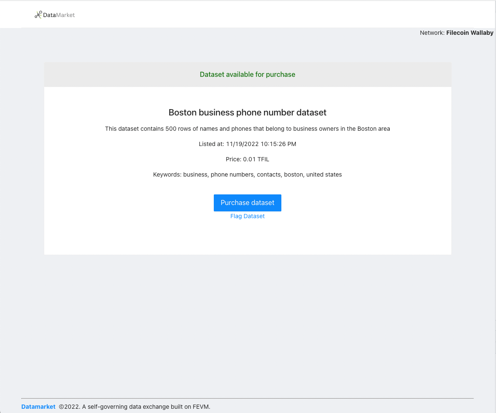

 

    

 

Datamarket
---

Datamarket is an open blockchain platform designed to enable anyone to create Data purchase or checkout pages on the FEVM network. 

This project was built for HackFEVM 2022 on ethglobal, submitted to the Best use of FEVM to build building blocks and general category.

<b>Note this project is currently a demo prototype and would require additional work to be production ready on FEVM mainnet.</b>

### Motivation

Decentralized exchanges, also known as DEXs, are peer-to-peer marketplaces where cryptocurrency traders make transactions directly without handing over management of their funds to an intermediary or custodian.

Existing data exchange platforms exist, like https://www.narrative.io/pricing, however either require long term commitments or having transactions mediated through a third party with high fees and staff overhead.

### How it works

Users create data pages which are purchase pages for secured IPFS datasets.

DataMarket is self-governing. If a bad or inaccurate dataset is uploaded and sold, a purchaser or potential purchaser can flag the dataset as being fraudulent. The dataset page is locked after three flags.

To ensure that the data provides user satisfaction, the user is only paid out from the contract after three non-flagged successful sales, and each sale after that. This is done automatically via logic tied to the `purchaseData` contract method 

Each dataset cannot be modified after it is posted, but the price can be updated by the owner and it can be marked as inactive. A new page should be created if a dataset needs to be changed - this protects the mutability and trust of existing pages.

Using FEVM smart contracts, Datamarket can:
1. Enable an immutable, append-only, history of interactions against DataMarket smartcontracts.
2. Store the data in a scalable/low-cost way for data owners, where no single source has to be the custodian of the data log.
3. Perform low cost, high volume, and fast transactions on the FEVM network.
4. Be self-governing by the user base and flag or shutdown any fraudulent pages by logic included in the FEVM smart contract.

### Technologies used

**FEVM**: Serves as the primary smart contract network for the Datamarket application. FEVM enables fast and low cost smart contract transactions that make it easy to use Datamarket in the field without heavy additional costs or time delays. The deployed `DataContract` also enforces that the dataset be valid by enabling public users to flag suspicious listings.

**IPFS**: Record keeping and storage. IPFS is used as the main backend for all uploaded datasets attached to DataContracts. The url of the asset is provided to the user post-purchase.

**WalletConnect**: Serves as the walletconnector for authorizing `DataMarket` contract deploys and enabling users to connect their wallets securely to the the DataMarket application.

The following contract events are emitted and can be listened to externally.

`PurchaseCompleted`: When a user completes the purchase on a data set page.
`PageFlagged`: When a user flags a page as not having legitimate data.

### Useful links
* Hardhat: https://hardhat.org/tutorial/writing-and-compiling-contracts
* Hackathon: https://ethglobal.com/events/hackfevm/home

### Running the app

Define the following environment variables.

<pre>
    REACT_APP_STORAGE_KEY=  // Your web3.storage key, used for IPFS storage of datasets.
    REACT_APP_ACTIVE_CHAIN_ID= // (Optional) Can be adjusted to FEVM mainnet in the future, for now this field should be unset or set to 31415 for wallaby testnet.
    REACT_APP_WC_ID= // cloud.walletconnect.com app id (defaults to a demo app id).
</pre>

`yarn; yarn start`

Datamarket should now be running on port 3000.

### Potential future work
* Add a usage fee that takes a small percentage of each purchase. This could be easily added to the checkout flow - for now the purchases are completely free.
* Permanent data removal support from the filecoin network (uploaded sets remain live post-flagging currently).
* Add a searchable interface to discover datasets built into the `DataMarket` application.
* Add support for user logins in addition to metamask (or wallet-based) logins.

<!--
## Screenshots / User flow

### Home page

### Connecting wallet

### Creating a new data listing

### Deployed

### IPFS listing of a hosted asset

### Purchase page for a dataset

### Contract structure

### Contract history

### Deployed contract

-->
<!--

Demo flow:
Web Article stating problem
- https://www.narrative.io/
Intro solution / website
Connect wallet
Create datamarket listing
- Original box image (IPFS/Filecoin for persistent, decentralized storage.)
- Adds funds to the contract to do chainlink interaction
Show deployed contract (FEVM, good for high volume packages or shipments)
Send a contract update with description.
Show contract event emitted from contract and new transaction.
Show contract history.
Closing (github+future work)

-- Sponsors--
Smart contract for delivery or record keeping
FEVM: Low cost smart contract transactions
Chainlink: Grab information from port and pull into the application
IPFS: Record keeping and storage

-->

